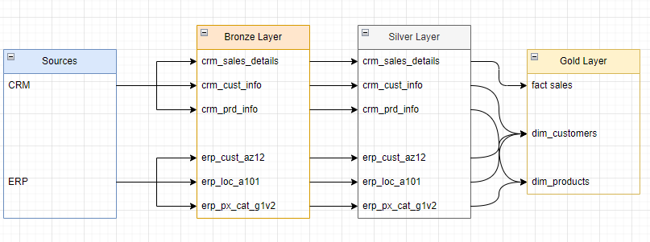
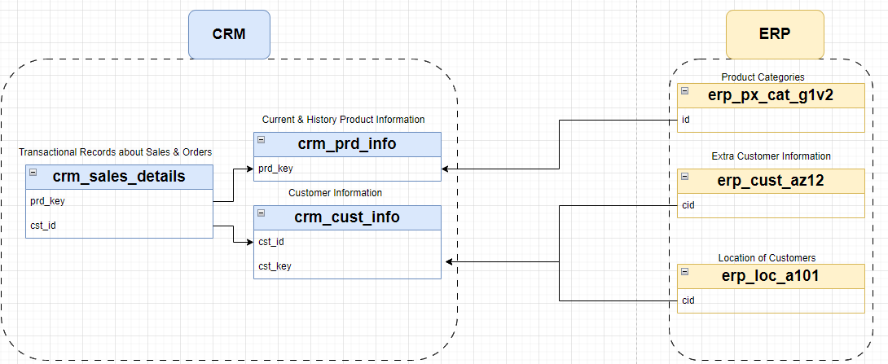
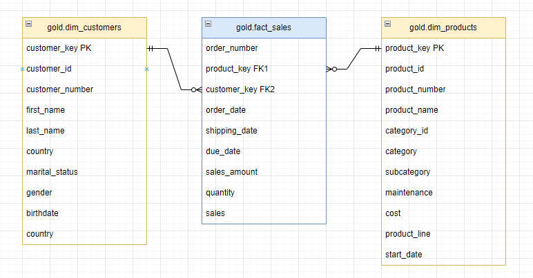

# Data Warehouse Project: Retail Bike Sales Analytics

# Project Overview
This data warehouse project implements a Medallion architecture solution for a retail bike sales company, enabling comprehensive sales analytics and business intelligence capabilities. The system integrates data from CRM and ERP sources, transforms it through a structured pipeline, and delivers actionable insights through dimensional models optimized for analysis.

## Data Architecture

*Figure 1: Medallion Architecture Data Flow*
This project uses the Bronze, Silver, Gold structure from the Medallion Architecture
### Bronze Layer: Raw Data Ingestion
 - Stores raw data straight from the source. Data is gathered from CSV files and transferred to a SQL Server Database.
 - Consists of the CRM source
   - `crm_sales_details` (sales and order transactions)
   - `crm_cust_info` (basic customer information)
   - `crm_prd_info` (product details)
 - Consists of the ERP source
   - `erp_cust_az12` (additional customer demographics)
   - `erp_loc_a101` (customer location data)
   - `erp_px_cat_g1v2` (product category and maintenance information)
  
### Silver Layer: Cleaned & Integrated Data
   
   *Figure 2: Source System Relationships and Transformation Flow*
   
   The Silver Layer serves as the data refinement hub where raw Bronze data becomes analysis-ready. Key processes:
  1. **Core Functions**:
   - Data cleaning (removing invalid orders, flagging missing values)
   - Standardization (consistent date formats)
   - Normalzation (customer matching across CRM/ERP systems)

2. **Key Outputs**:
   - Unified customer profiles (merged from 3 source systems)
   - Clean product catalog
   - Error-free sales transactions

  - Gold Layer: Provides final analytical views read for reporting and business intelligence.
  - Enables insights into customer behavior, sales trends, and product performance.
### Gold Layer: Business Intelligence Ready
  

  *Figure 3: Optimized Analytical Data Model*
  
The Gold Layer transforms integrated Silver data into actionable business intelligence through optimized dimensional models that drive decision-making across the organization.

**Dimensional Design:**
- Star schema architecture
- Optimized fact and dimension tables
- Historization of key attributes
- 
**User-Centric Optimization:**
- Business-friendly naming conventions
- Consistent column labeling
- Logical grouping of related metrics

  
